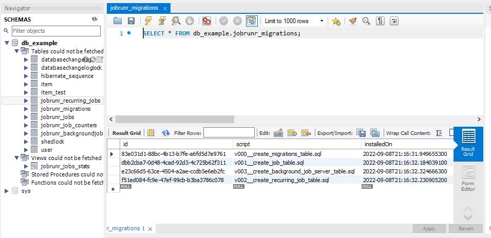
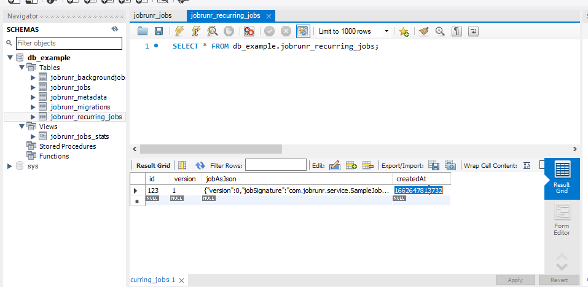
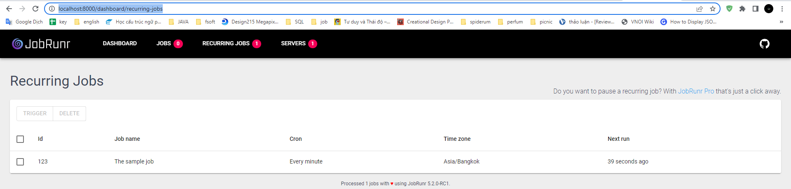

# JobRunr

we're going to look into distributed background job scheduling and processing in Java using JobRunr and have it integrate with Spring.

### The biggest stronger than @Scheduled is, we can trigger this job everytime.








you can access this link to view dashboard

```text
    http://localhost:8000/dashboard/recurring-jobs
```




```text
POST http://localhost:8080/jobrunr/scheldule
Content-Type: application/json

{
    "id": 123,
    "cron": "0/20 * * * * *"
}


POST http://localhost:8080/jobrunr/scheldule/stop/123

GET http://localhost:8080/jobrunr/enqueue/123
```